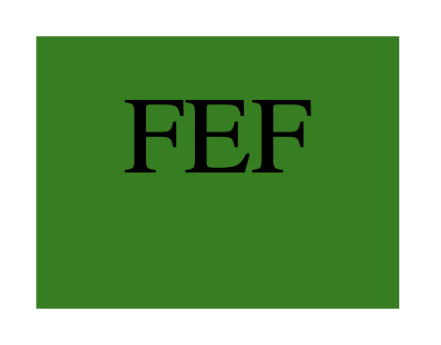
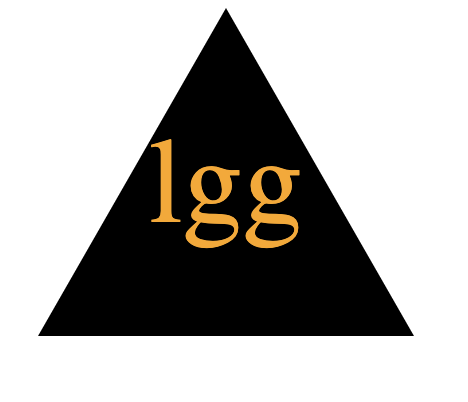
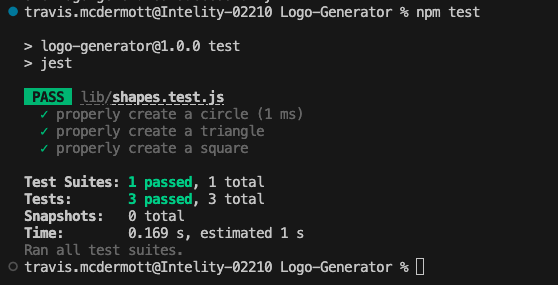

# Logo-Generator

## Description
  Utilize a command line interface to create and SVG file in the shape of a traingle, circle or a square.

## URL of Deployed Application
  This is a command line application so there is no URL to run the application

## Demonstration of Deployed Application

[Logo Generator Demo](https://drive.google.com/file/d/1V-380QF14ewZglSV17dxLg0KOLVvRHOs/view?usp=sharing)

## Screenshots of Examples

## Table of Contents
  - [Installation](#installation)
  - [Usage](#usage)
  - [Contributing](#contributing)
  - [Tests](#tests)
  - [Technologies](#technologies)
  - [License](#license)
  - [Questions](#questions)

## Installation
  This is a command line interface. You will need to use git clone to clone the repository into your local machine. And follow the instructions below to run the program.

## Usage
  This can be used to generate an SVG file with up to 3 text characters into a colored shape (triangle, square or circle)

## Contributing
  N/A

## Tests
  1. Navigate to the folder in your terminal. 
  2. Type node index 
  3. Enter 3 characters as directed. 
  4. Enter a color for the font of those threwee characters. 
  5. Use thyour arrow keys to select a shape. 
  6. Select a color. 
  
  Your logo will automatically populate in the logo.svg file

## Technologies
  
  Node.js, package.json, Inquirer NPM Package, SVG

## License

  None

## Questions

  For any additional questions or feedback, please contact me with the following information:
  Github: (https://github.com/tjmcd2010)
  Email: (mailto:tjmcd2010@gmail.com)  